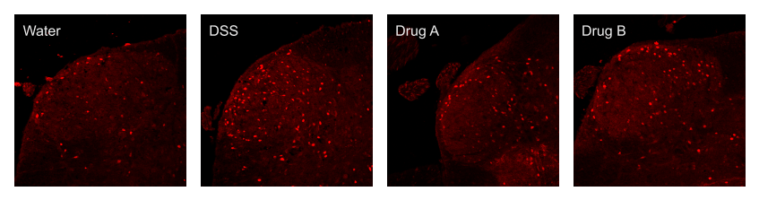

# Introduction

  The data presented were generated using Gemini to be similar to a series of experiments completed during my MSc in Neuroscience ([Svendsen, 2023](https://hdl.handle.net/1880/116587)) and were later published in the Journal of Pharmacology and Experimental Therapeutics ([Svendsen et al., 2025](https://pubmed.ncbi.nlm.nih.gov/39921943/)). The data consist of confocal microscopy images of immunohistochemical staining for the neuronal activity marker cFos in L6-S1 spinal cord slices (Fig 1). The neurons within the spinal cord are discretely organized and the different layers receive signals from specific parts of the body. In this context, a larger number of cFos positive neurons located in the dorsal horn indicates greater nociceptive (pain) signalling from the stimulated tissue ([Harris, 1998](https://pubmed.ncbi.nlm.nih.gov/9434195/); [Abdullah et al., 2020](https://pubmed.ncbi.nlm.nih.gov/33026824/)). This experiment used the dextran-sulfate sodium (DSS) model of inflammatory bowel disease [(Chassaing et al., 2015)](https://pubmed.ncbi.nlm.nih.gov/24510619/) and examined the efficacy of a hypothetical Drug as treatment for the associated acute visceral pain. Mice were divided in four groups: 
  
  1. Negative control mice received normal water and the drug vehicle (Water)
  2. Positive control mice received DSS adn the drug vehicle (DSS) 
  3. Experimental group 1 which received DSS and Drug A (DrugA) 
  4. Experimental group 2 which received DSS and Drug B (DrugB) 


```{r Example Images, echo=FALSE, fig.cap=" Fig 1. Example images of immunohistochemical staining for the neuronal activity marker cFos in the lumbosacral dorsal horn from unpublished experiments", out.width='100%'}

```


#Library
```{r Library, echo=TRUE, message=FALSE, warning=FALSE}
library(tidyverse)
library(skimr)
library(car)
library(ggpubr)
library(RColorBrewer)
library(ggsignif)
library(rstatix)

```


# Cleaning 
## Import and inspect data.
```{r Import and inspect data}
cfos.dat <- read.csv(file = "./Gemini_cFos.csv", header = T, sep =",")

summary(cfos.dat)
glimpse(cfos.dat)


```

## Rename headers and rename negative control.
```{r rename headers and verify data types}

cfos.dat <- cfos.dat %>% #lowercase headers
  rename_with(tolower)

cfos.dat[cfos.dat == "Vehicle"]<- "Water" #replace "Vehicle" with "Water"
```

## Verify data types.
```{r Verify data types}
is.factor(cfos.dat$condiion)
cfos.dat$condition = as.factor(cfos.dat$condition)
is.factor(cfos.dat$condition)

is.factor(cfos.dat$mouse)
cfos.dat$mouse = as.factor(cfos.dat$mouse)
is.factor(cfos.dat$mouse)
```

## Reorder data. 
```{r Reorder data}
sort_order <- c("Water", "DSS", "DrugA", "DrugB") #define order

cfos.dat_sorted <- cfos.dat %>% 
  mutate(condition = fct_relevel(condition, sort_order)) %>% 
  arrange(condition)
```


# Analysis

## Compute average cFos count per mouse and store n value.
The raw data consist of multiple images of different slices of spinal column within the relavent level; subsequently, the average for each mouse must be computed. We will also store the resulting n-values in an object for easy reporting.
```{r average images and store n}


mouse.dat <- aggregate(cfos.dat_sorted[,2], list(cfos.dat_sorted$mouse, cfos.dat_sorted$condition), FUN = mean)

names(mouse.dat)[1]<-'mouse'
names(mouse.dat)[2]<-'condition'
names(mouse.dat)[3]<-'count_avg'

n_values <-table(mouse.dat$condition)
print(n_values)
```

## ANOVA and pairwise comparison using Tukey's honestly significant difference.
```{r anova and tukey, echo=TRUE}
anova.cfos <- aov(count_avg ~ condition, data = mouse.dat)
anova <- Anova(anova.cfos, type ="II")
print(anova)  


tukey <- tukey_hsd(anova.cfos)
print(knitr::kable(tukey, caption = "TukeyHSD"))
```
The ANOVA showed a main effect of condition. The follow-up pairwise comparisons showed the negative and positive control groups (Water and DSS, respectively) to be significantly different suggesting that the experimental model performed as expected; therefore, we can examine our experimental groups. There was no effect of Drug A; however, Drug B showed a significant reduction compared to the DSS group. 


# Visualization
## Select pairwise comparisons for the figure.
Based on the results discussed above, there are 4 main comparisons that should be shown in the figure:

1. Water and DSS to demonstrate that the model performed as expected.
2. Drug A and DSS to show that this dose was ineffective.
3. Drug B and DSS to show that this dose was effective.
4. Drug B and water to show that this dose did not reduce responses to negative control levels.
```{r select pairwise for figure}

tukey_figure <- tukey[c(1,3,4,5),] #select rows containing pairwise comparisons

```

## Create a Boxplot.
```{r figure, message=FALSE, warning=FALSE}


bp <- ggboxplot(mouse.dat, x = "condition", y = "count_avg",
                fill = "condition", 
                add = "dotplot" , add.params = list(size = 1.6, alpha = 1), 
                ylab = "cFos+ Nuclei per Section", xlab = "Condition")+
  coord_cartesian(
    xlim = NULL,
    ylim = c(0, 80),
    expand = TRUE,
    default = FALSE,
    clip = "off")+
  stat_pvalue_manual(tukey_figure, 
                     label = "p.adj.signif", #to show exact p-value use "p.adj"
                     y.position = 45, step.increase = 0.3)+ #p-value bars location
  theme(legend.position = "none") +#remove legend
  scale_fill_brewer(palette ="Set1") #add colors
bp


```

# Print key statistics for write-up
```{r stats summary}
key_stats <- list("n_values" = n_values,"anova" = anova, "tukey_hsd" = knitr::kable(tukey))
print(key_stats)

#print figure
ggsave("immuno_plot.png", plot = bp)
```

# Conclusion
Results showed a significant effect of condition (F(3) = 42.726, p < 0.001). Post-hoc analysis (Tukey HSD) showed significant differences between Water and DSS conditions (p < 0.001) suggesting that our DSS model and cFos measure performed as expected. While treatment with Drug A did not reduce cFos counts compared to DSS controls (p = 0.43610), Drug B did significantly reduce cFos counts compared to DSS controls (p = 0.0016). Notably, cFos counts for Drug B were still significantly greater than non-DSS (Water) controls (p = 0.0027). Together, these results suggest that treatment with Drug B ameliorated visceral nociception in the DSS model of IBD. 
